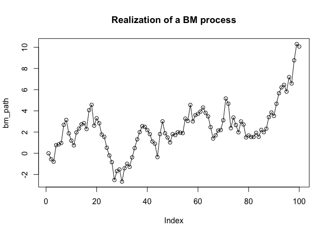
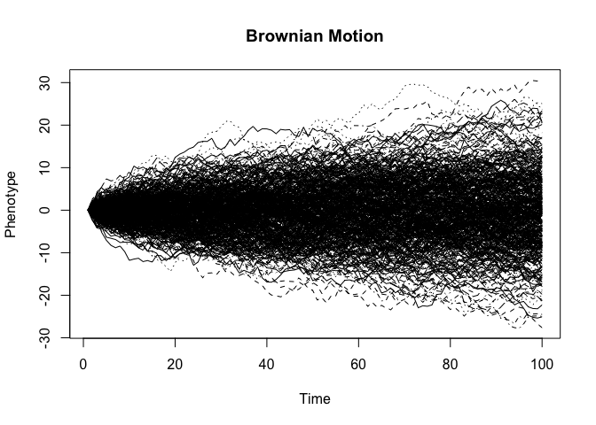
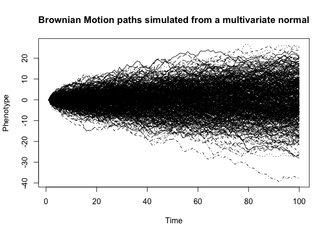
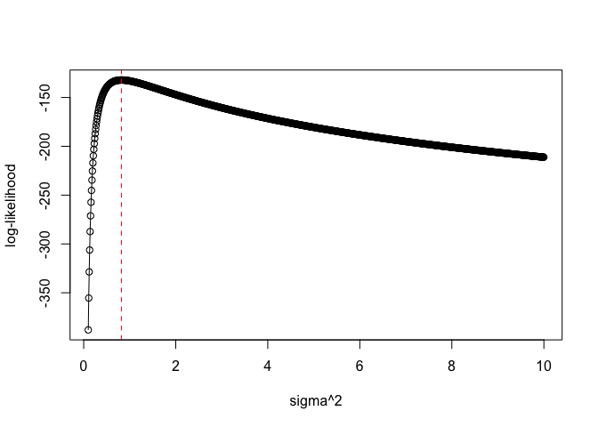
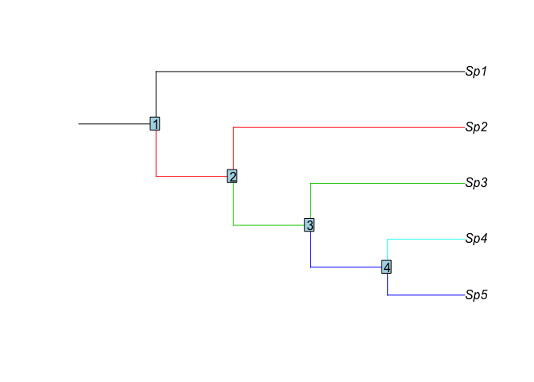
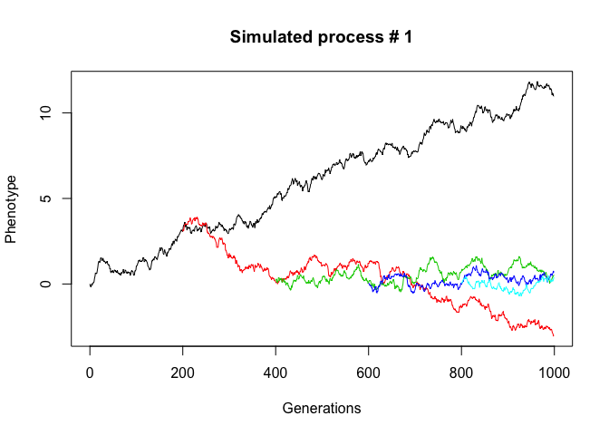
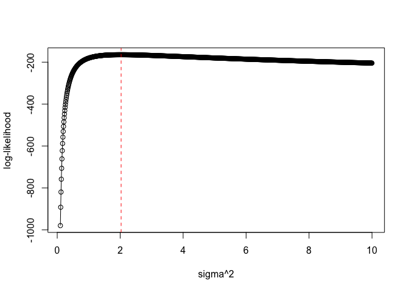

***


# Exploring the Brownian motion process

In this section we will consider the BM process itself through simulations with **R**. We will first start by studying the simple path of a BM process through time (a random-walk time-series), the relationship with the multivariate normal distribution and how to estimate the parameters. Then, we will extend these simulations to a BM process evolving on a phylogenetic tree.

## Simulating Brownian motion (BM) process in R


The Brownian motion (BM) is a diffusion process defined by the stochastic differential equation (SDE):

$$
dX = \sigma dB(t)
$$

Where $dB(t)$ are independently and identically distributed normal (Gaussian) random variables each with mean = 0 and variance _dt_. 

It's pretty easy to simulate the path of a BM process in **R**. Let's start by making a simple function incrementing at each time steps small Gaussian deviates.

```r
# Simul BM function
sim.bm <- function(){
  x <- numeric(100)
  for(i in 1:99)
    x[i+1] <- x[i] + sigma * rnorm(1)
  return(x)
}
```

Try to simulate a BM process and plot the realization:

```r
set.seed(123) # we fix the random number generator for reproducibility
# set the step variance sigma^2 = 1
sigma = sqrt(1)
bm_path <- sim.bm()
plot(bm_path, type="o", main="Realization of a BM process")
```

<!-- -->

In the previous function, _sigma^2_ is the step variance. Multiplying this parameter to _t_ will give us the expected variance accumulated at time _t_.

Let's simulate a lot of realizations to figure out what happens:

```r
Xbm<-replicate(500, sim.bm()) # Generate 500 realizations 
ylbm <- range(Xbm)            # Recover the whole range of the realizations
matplot(Xbm, ylim=ylbm, type="l",col=1, main="Brownian Motion",
        xlab="Time", ylab="Phenotype")
```

<!-- -->

From the plot we can observe that:

+ The expectation of the process over realizations stays the same through time
+ The variance accumulates through time

What is the total variance accumulated over these 500 simulations of the same process?

```r
var(Xbm[100,])# Variance measured at the end of the process; i.e. time point #100
```

```
> [1] 87.57651
```

```r
# expected variance is sigma^2 * t = 100
# We can try to increase the number of simulations
# to obtain a more accurate approximation
set.seed(123)
Xbm_Large_sample<-replicate(10000, sim.bm())
var(Xbm_Large_sample[100,])
```

```
> [1] 98.54237
```


```r
# Note that from the simulated data we can recover back the value of the step
# variance -sigma- by measuring the variance on differentiated values
# (the distribution of the small increments drawn from the Gaussian)
## First derivative obtained by differentiating
diff_bm <- apply(Xbm, 2, diff)
hist(diff_bm, main="distribution of net changes")
var(as.vector(diff_bm))
# we expect a Gaussian distribution centered on 0 and with variance 1.
```

We can simulate the same process directly by considering the distribution of all samples means jointly. Given the previous observations, we can sample from a multivariate normal distribution to simulate the whole BM path. For this purpose we must know the mean (expectation) as well as the variances at different time points, but also the expected covariances between the successive time points.

Recall:

The variance of a random variable is the expected value of the squared deviations from its expectation:

$$
Var(X) = E[(X - E[X])^2]
$$

The covariance of two random variables is the expected value of the product of the deviations of both from their expectation:

$$
Cov(X,Y) = E[(X - E[X]) (Y - E[Y])]
$$

Both the variances and covariances are often represented in a matrix, which is easily computed using the _cov_ function in R for instance. We can use similar formulas to compute the cross-covariance (covariances between pairs of time points).

We will use a multivariate-Normal distribution centered on 0 (as seen before the expectation of the process doesn't change) with the empirical variances-covariances matrix to simulate again the BM process:


```r
X <- t(Xbm_Large_sample) # the rows must be the 10000 realization...
# to check
# dim(X)

# Compute the variances and covariances between the realizations 
# over the 10000 BM processes at each times points.

cov_BM <- cov(X)

# without the built-in function "cov", we use the cross-product
# of column centered matrices:
# X <- scale(X, center=TRUE, scale=FALSE)
# cov_BM <- t(X)%*%X / (10000 - 1)
# Note: the random walk is Markovian with null changes of the expected value

library(MASS)
# ?mvrnorm ; function for sampling from a multivariate normal
New_BM_process <- mvrnorm(n=500, mu=rep(0,100), Sigma=cov_BM)

ylbm <- range(New_BM_process)            # Recover the whole range of the realizations
matplot(t(New_BM_process),ylim=ylbm, type="l",col=1, 
        main="Brownian Motion paths simulated from a multivariate normal",
        xlab="Time", ylab="Phenotype")
```

<!-- -->

Closer inspection of the empirical covariance matrix show that the variance of each time points _i_ ($X_i$) across all the simulated paths is approximately:

$$
Var[X_i] = \sigma^2t_i
$$

Its covariance with others time points is:

$$
Cov[X_i,X_j] = \sigma^2 \times min(t_i,t_j)
$$

In other words, the variance is proportional to time and the covariance between two time points is the variance accumulated up to the older point in time. The random walk is therefore not stationary. We can also demonstrate it by taking $X_j=X_i + \delta_t$, where $\delta_t$ is an iid normal deviate with mean 0 and variance $\sigma^2$, and showing that 
$$Cov[X_i,X_j]=Cov[X_i+\delta_t,X_i]=Cov[X_i,X_i]+Cov[\delta_t,X_i]=Var[X_i]+0$$
Using the general property of covariances: $Cov[X+Y,Z]=Cov[X,Z]+Cov[Y,Z]$.

The interesting fact is that we can use these relationships to the multivariate normal distribution to compute the (joint) likelihood of a BM realization.

Recall :

The multivariate normal density is :

$$
f_{\mu,\Sigma}(x) = \frac{1}{(2\pi)^{N/2} det(\Sigma)^{1/2}} e^{-\frac{1}{2}(x - \mu)^T\Sigma^{-1}(x-\mu)}
$$

We can code a simple function for computing the (log)-likelihood for a vector of values _x_.

```r
# Log-likelihood function
log_likelihood <- function(x, Sigma, mu=0){
  n <- length(x)   
  det_log <- determinant(Sigma)$modulus
  const <- n*log(2*pi) 
  ll <- -0.5*(t(x - mu)%*%solve(Sigma)%*%(x - mu) + const + det_log)
  return(ll)
}

# Compute the expected covariance matrix given by the spacing 
# of the time points (see the relationship above)
times <- 1:100
time_cov <- outer(times, times, FUN=pmin)
Sigma <- time_cov * sigma^2

# The likelihood for the first simulation
log_likelihood(X[1,], Sigma)
```

```
>           [,1]
> [1,] -133.0208
> attr(,"logarithm")
> [1] TRUE
```

```r
# Note: we can use built-in function in R from the package "mvtnorm" 
# to obtain the multivariate normal density
# library(mvtnorm)
# sum(dmvnorm(X[1,], mean = rep(0,100), sigma = Sigma, log = TRUE))
# this is the multivariate counterpart of the "dnorm" function.
```

By optimizing the likelihood score with respect to the parameters values we can recover the parameters used to generate the data from a single realization. This makes the likelihood an interesting objective function for assessing the fit of models and inferring parameters:


```r
# Let's make a likelihood function of the vector X[1,] with respect to sigma^2
what_is_sigma_fun <- function(sigma2) log_likelihood(X[1,], time_cov * sigma2)

# guesses for "sigma"
sigma_values <- seq(0.1, 10, 0.01)         
# compute the log-likelihood for all the sigma values
log_lik_values <- sapply(sigma_values, what_is_sigma_fun)

# what is the value that maximize the log-likelihood?
best_estimate <- sigma_values[which.max(log_lik_values)]
print(best_estimate)
```

```
> [1] 0.82
```

```r
# Plot the likelihood surface with respect to sigma values
plot(sigma_values, log_lik_values, type="o", xlab="sigma^2", ylab="log-likelihood")
abline(v=best_estimate, col="red", lty=2)
```

<!-- -->

```r
# Note that here we are assuming that X_0 is known and equal to zero. 
# See below for its estimation
```

There are many general-purpose algorithms already implemented in R to optimize an objective function. For instance, we can use the _optim_ function to evaluate the log-likelihood


```r
# we can use built-in functions in R to optimize a function like the likelihood
# see for instance ?optimize or ?optim
optim(0.1, fn=what_is_sigma_fun, control=list(fnscale=-1))
# ok! we find a similar value to the one observed with the "grid" search
```


Ok! Now let's use the same concepts for modeling traits evolving on a tree.


# A BM process evolving on a tree


The most common format used for representing trees is the "parenthetic" format (e.g., NEXUS trees), where both the information on the topology [given by the parenthesis] and the branches lengths [number after the species name] are provided.

Let's start with a small tree in R.

```r
# In the following example we will use a 5 species tree
TREE <- "Edge( ( ((Sp5:2,Sp4:2):2,Sp3:4):2,Sp2:6):2,Sp1:8):2;"

# The core package for handling trees is "ape" - Analyses of Phylogenetics and Evolution
library(ape)
tree <- read.tree(text = TREE)

# Plot the tree and label the nodes
plot(tree, root.edge=TRUE, edge.color=c(2,3,4,4,5,3,2,1))
nodelabels(1:4)
```

<!-- -->


Now we want to simulate traits evolving as a BM process on the branches of this tree.

```r
# First define the function for simulating the SDE
bm_model<- function(x0, nsteps=50, sigma)
{
	x <- numeric(nsteps)
    x[1] <- x0
	for (i in 1:(nsteps-1))
	{
		x[i+1] <- x[i] + sigma*rnorm(1, mean=0, sd=1)
	}
return(x)
}
```

This function is quite similar to the one we used before, except that we can change the starting value of the process, the step variance (rate of changes) and the number of steps in the random walk.


```r
# ------ Model parameters
theta0 <- 0        # The state at the root of the tree (i.e., X_0)
sigma <- sqrt(0.01) # The step variance of the process is 0.01 (so that sigma^2*t=10)

nsims <- 5000      # We take a relatively large number of simulations 

# splitting times (size of the branches) 
# for 4 bifurcating event and a total length of 1000 steps BM
split_time <- c(200,200,200,200)
nsplit_end <- c(1000,800,600,400,200)

# vectors and lists for storing the results
x0_branch <- list()
x1_branch <- list()
x2_branch <- list()
x3_branch <- list()
x4_branch <- list()

# Do the simulation

for (i in 1:nsims){
	# Call random walks for each branch of the phylogeny
	x0 <- bm_model( theta0, nsplit_end[1], sigma)            # from the root to Sp1
	x1 <- bm_model( x0[split_time[1]], nsplit_end[2], sigma) # from node 1 to Sp2 
	x2 <- bm_model( x1[split_time[2]], nsplit_end[3], sigma) # from node 2 to Sp3 
	x3 <- bm_model( x2[split_time[3]], nsplit_end[4], sigma) # from node 3 to Sp4 
	x4 <- bm_model( x3[split_time[4]], nsplit_end[5], sigma) # from node 4 to Sp5 

	x0_branch[[i]] <- x0
	x1_branch[[i]] <- x1
	x2_branch[[i]] <- x2
	x3_branch[[i]] <- x3
	x4_branch[[i]] <- x4
}
```

We can plot the simulated path for one of the realizations


```r
# Take an example among the simulated processes (just change i to pick out another one)
i = 1
range_process <- range(c(unlist(x0_branch[[i]]),unlist(x1_branch[[i]]),
                         unlist(x2_branch[[i]]),unlist(x3_branch[[i]]),
                         unlist(x4_branch[[i]])))
plot(0:(nsplit_end[1]-1), x0_branch[[i]], type="l",
     ylim=range_process, xlab="Generations", ylab="Phenotype",
     main=paste("Simulated process #",i))
lines((nsplit_end[1]-nsplit_end[2]):(nsplit_end[1]-1), x1_branch[[i]], col=2)
lines((nsplit_end[1]-nsplit_end[3]):(nsplit_end[1]-1), x2_branch[[i]], col=3)
lines((nsplit_end[1]-nsplit_end[4]):(nsplit_end[1]-1), x3_branch[[i]], col=4)
lines((nsplit_end[1]-nsplit_end[5]):(nsplit_end[1]-1), x4_branch[[i]], col=5)
```

<!-- -->

Now, as for the simple BM path through time, we can compute the empirical (evolutionary) variances and covariances of the BM process on the tree. If phenotypic evolution follows a Markovian process along a phylogeny with characters evolving independently along each branch, then the theoretical covariance between a single trait measured in two different species $X_i$ and $X_j$ with ancestor value $X_z$ is (see  Felsenstein 1988, Hansen & Martins 1996):
$$
Cov[X_i,X_j] = Cov[E[X_i | X_z], E[X_j | X_z]]
$$
Given that under Brownian motion the expected value of a species mean phenotype _i_, given the mean phenotype of an ancestor _z_, is equal to the mean phenotype of that ancestor (this follows from the definition of BM - the changes in expected value is null). It follows that:

$$
E[X_i | X_z] = X_z
$$

and

$$
E[X_j | X_z] = X_z
$$

Thus,

$$
Cov[X_i,X_j] = Cov[X_z,X_z] = Var[X_z]
$$

This mean that the expected covariance between species _i_ and _j_ in a BM process is the variance accumulated during the shared history of those species and is therefore proportional to the time elapsed from the root of the tree to the most recent common ancestor (_z_) to both species. The **expected** phylogenetic variance-covariance matrix under an homogeneous Brownian motion (up to a proportional constant) is easily obtained with the _vcv.phylo_ function from the _ape_ package (Paradis et al. 2004).


```r
# Compute the empirical evolutionary variances and covariances
# E[(Xi-E[Xi])*(Xj-E[Xj])]; Similar formulation as for random variables 
# We just saw that in the BM case: Cov[Xi,Xj] = E[(X_z - E[X_z])^2]


# The expectation for node #1
Xz <- mean(sapply(1:nsims, function(x) x0_branch[[x]][200]))
# The covariance between Sp1 and Sp2; i.e. E[(X_z - E[X_z])^2]
cv1 <- mean(sapply(1:nsims, function(x) (x0_branch[[x]][200]-Xz)^2))

# Do the same for the remaining covariances 
Xz <- mean(sapply(1:nsims, function(x) x1_branch[[x]][200]))
cv2 <- mean(sapply(1:nsims, function(x) (x1_branch[[x]][200]-Xz)^2))

Xz <- mean(sapply(1:nsims, function(x) x2_branch[[x]][200]))
cv3 <- mean(sapply(1:nsims, function(x) (x2_branch[[x]][200]-Xz)^2))

Xz <- mean(sapply(1:nsims, function(x) x3_branch[[x]][200]))
cv4 <- mean(sapply(1:nsims, function(x) (x3_branch[[x]][200]-Xz)^2))


# We apply the formula to compute the total variance Var[Xi] = E[(Xi-E[Xi])^2]
# at each tips values
E1 <- mean(sapply(1:nsims, function(x) x0_branch[[x]][1000]))
E2 <- mean(sapply(1:nsims, function(x) x1_branch[[x]][800]))
E3 <- mean(sapply(1:nsims, function(x) x2_branch[[x]][600]))
E4 <- mean(sapply(1:nsims, function(x) x3_branch[[x]][400]))
E5 <- mean(sapply(1:nsims, function(x) x4_branch[[x]][200]))

v1 <- mean(sapply(1:nsims, function(x) (x0_branch[[x]][1000]-E1)^2))
v2 <- mean(sapply(1:nsims, function(x) (x1_branch[[x]][800]-E2)^2))
v3 <- mean(sapply(1:nsims, function(x) (x2_branch[[x]][600]-E3)^2))
v4 <- mean(sapply(1:nsims, function(x) (x3_branch[[x]][400]-E4)^2))
v5 <- mean(sapply(1:nsims, function(x) (x4_branch[[x]][200]-E5)^2))

# In general however, the covariation for two processes X and Y is 
# E[(Xz - Xz-1)(Yz - Yz-1)]. Hence, we should have taken Xz-1 to be the state at
# the root... However it's similar here given that there are no changes of
# the expected value...

# We can build the covariance matrix for the tree
cov_tree <- diag(c(v1,v2,v3,v4,v5))
cov_tree[1,2] <- cov_tree[2,1] <- cv4
cov_tree[1:2,3] <- cov_tree[3,1:2] <- cv3
cov_tree[1:3,4] <- cov_tree[4,1:3] <- cv2
cov_tree[1:4,5] <- cov_tree[5,1:4] <- cv1

print(round(cov_tree))
```

```
##      [,1] [,2] [,3] [,4] [,5]
## [1,]   10    8    6    4    2
## [2,]    8   10    6    4    2
## [3,]    6    6   10    4    2
## [4,]    4    4    4   10    2
## [5,]    2    2    2    2   10
```

```r
# Compare now with the expected variance covariance provided by the tree branch lengths:
vcv.phylo(tree) + 2 
```

```
##     Sp5 Sp4 Sp3 Sp2 Sp1
## Sp5  10   8   6   4   2
## Sp4   8  10   6   4   2
## Sp3   6   6  10   4   2
## Sp2   4   4   4  10   2
## Sp1   2   2   2   2  10
```

```r
# Here we add the covariance due to the shared root edge (2) of the simulated tree.
# In practice the branch at the root is often omitted and we assume that the root
# state is either fixed or have it's own distribution.
```

*Try now the same experiment but change the $\sigma^2$ value in the simulations. What do you observe?*

## Estimating model parameters with the VCV matrix

We can use the phylogenetic covariance matrix (VCV matrix) and the multivariate Normal density to recover the parameter estimates, for instance the step variance of the BM process. This value is often referred to as the rate of phenotypic evolution as it defines the rate at which changes accrues over the tree. Here we will simulate a bigger tree as we obviously expect a low statistical power from the five tips tree we used before...


```r
library(mvMORPH)
```

```
> Loading required package: phytools
```

```
> Loading required package: maps
```

```
> Loading required package: corpcor
```

```
> Loading required package: subplex
```

```
> ##
> ## mvMORPH package (1.1.0)
```

```
> ## Multivariate evolutionary models
```

```
> ##
> ## See the tutorials: browseVignettes("mvMORPH")
```

```
> ##
> ## To cite package 'mvMORPH': citation("mvMORPH")
> ##
```

```r
set.seed(123) # for reproducibility

# Simulate a Pure-birth tree with 100 tips
tree <- pbtree(n=100)

# now simulate a trait evolving at a rate (sigma^2) = 2
trait <- mvSIM(tree, model="BM1", param=list(sigma=2, theta=0))

# we just reuse the likelihood function from before
tree_cov <- vcv.phylo(tree)
bm_tree <- function(sigma2) log_likelihood(trait, tree_cov * sigma2)

# guesses for "sigma"
sigma_values <- seq(0.1, 10, 0.01)         
# compute the log-likelihood for all the sigma values
log_lik_values <- sapply(sigma_values, bm_tree)

# what is the value that maximize the log-likelihood?
best_estimate <- sigma_values[which.max(log_lik_values)]
print(best_estimate)
```

```
> [1] 2.03
```

```r
# Plot the likelihood surface with respect to sigma values
plot(sigma_values, log_lik_values, type="o", xlab="sigma^2", ylab="log-likelihood")
abline(v=best_estimate, col="red", lty=2)
```

<!-- -->

Compare the results with those obtained with the _mvBM_ function in mvMORPH (?mvBM). Try to optimize the function with the _optim_ function in R.


```r
mvBM(tree, trait, model="BM1")
```

In fact, the small discrepancy between the _mvBM_ output and the small function we made before come from the trait estimated for the root state (i.e., the mean estimate $\mu$ in the log-likelihood function). If we take into account the covariation between observations when computing the mean (i.e. the root state; see the simulation above) we will find a similar result. Therefore, in what follows we replace the estimate of $\mu$ by the generalized least square (GLS) estimate:

$$
\mu = (1^t\Sigma^{-1}1)^{-1}1^t\Sigma^{-1}x
$$

Where $1$ is a $N \times 1$ column vector of 1, and $\Sigma$ is the phylogenetic variances-covariances matrix we just studied before. It can be shown that this estimate is the maximum likelihood solution (_e.g._ by taking the derivative of the multivariate normal likelihood with respect to $\mu$).


```r
# Log-likelihood function
GLS_log_likelihood <- function(x, Sigma){
  n <- length(x)   
  D <- matrix(1,nrow=n,ncol=1)
  mu <- solve(t(D)%*%solve(Sigma)%*%D)%*%t(D)%*%solve(Sigma)%*%x

  det_log <- determinant(Sigma)$modulus
  const <- n*log(2*pi) 
  ll <- -0.5*(t(x - D%*%mu)%*%solve(Sigma)%*%(x - D%*%mu) + const + det_log)
  return(ll)
}

# compute the theoretical VCV and optimize the scaling factor (BM rate)
cov_tree <- vcv.phylo(tree)
optim(0.1, fn=function(x) GLS_log_likelihood(trait, x*cov_tree),
      control=list(fnscale=-1))

# Now the results are similar...
```

How many parameters are effectively estimated in this simple BM process?

Try now to estimate a model with changing rates through time with the following SDE:

$$
dX(t) = \sigma_0^2 e^{-rt}dB(t)
$$

using the same function as before. Try to generate the expected variance-covariance of this process through simulations. In general, the moments of an SDE can be found using Itô's results...

# Itô process

Alternatively, we can write the SDE as an Itô process (i.e. a process expressed as the sum of an integral with respect to time and a stochastic integral) which allows the computation of the solution of the SDE and the two firsts moments analytically. For instance, the general SDE:

$$dX = A(t)dt + B(t)dW(t)$$ 

Have for solution the following Itô process:
$$ X(t) = X_0 + \int_{0}^{t} A(s)ds + \int_{0}^{t} B(s)dW(s) $$
The _A_ term is called the drift, and the _B_ term is called the diffusion (within the Ito's or stochastic integral). We can note also that the process is Gaussian, provided that $X_0$ is either non-random or gaussian, since the stochastic integral is simply a linear combination of infinitesimal Gaussian variables (see Gardiner 2004). We can then directly recover the moments of the process from this expression. For instance, given that the expectation of the Itô integral vanishes, we have the first moment (the mean) as:

$$E[X(t)] = X_0 + \int_{0}^{t} A(s)ds$$

and the second moment (the variance) is obtained as follow

$$E[(X(t) - E[X(t)])^2] = Var[X(t)] = E[(\int_{0}^{t} B(s)dW(s))(\int_{0}^{t} B(s)dW(s))] $$
We have the term $(dW(s))^2 = ds$ by Itô's isometry (or Itô's multiplication table to multiply deterministic and stochastic infinitesimal changes; see Gardiner 2004 p. 87 for a proof), hence we can write the second moment as:

$$ Var[X(t)] = \int_{0}^{t} B(s)^2ds $$


Similarly, the covariance $Cov[X(s), X(t)]$ is obtained as follow:

$$Cov[X(s), X(t)]=E[(\int_{0}^{t} B(t')dW(t'))(\int_{0}^{s} B(s')dW(s'))]=\int_{0}^{min(t,s)} B(t')^2dt'$$

If we find an analytical solution to the integrals, we can then directly obtain the variance and the mean of the process (this is the case for most commonly used models such as Brownian motion or Ornstein-Uhlenbeck processes - see below), otherwise we can use numerical approaches to obtain an approximation to these integrals or express those equations as ODE systems and use ODE's solvers. This is particularly useful when _A_ or _B_ are represented by non-trivial deterministic functions (e.g. Drury et al. 2016, Clavel & Morlon 2017, Manceau et al. 2017). We might also need to use variation of parameters or an integrating factor to solve some differential equations (or stochastic differential equation using Itô-Doeblin lemma). This is for instance the case of the Ornstein-Uhlenbeck process.

## Example for Brownian motion

The following SDE:

$$dX = \sigma dW(t)$$ 

Is solved by integrating:
$$ X(t) = X_0 + \int_{0}^{t} \sigma dW(s) $$

Hence, the first moment is:
$$E[X(t)]=X_0$$
and the second is:
$$Var[X(t)]= \int_{0}^{t} \sigma^2 ds=\sigma^2(t-0)$$
We find similar results as those seen previously empirically...


# Acknowledgements

Thanks to A. Camacho for pointing some errors in a previous version of this document.

# References

**Clavel J., Morlon H. 2017.** Accelerated body size evolution during cold climatic periods in the Cenozoic. Proc. Natl. Acad. Sci. 114:4183–4188.

**Drury J., Clavel J., Manceau M., Morlon H. 2016.** Estimating the effect of competition on trait evolution using maximum likelihood inference. Syst. Biol. 65:700–710.

**Felsenstein J. 1988.** Phylogenies and quantitative characters. Annu. Rev. Ecol. Evol. Syst. 19:445–471.

**Gardiner C.W. 2004.** Handbook of Stochastic Methods for Physics, Chemistry and the Natural Sciences; Third Edition. Springer, Berlin.

**Hansen T.F., Martins E.P. 1996.** Translating between microevolutionary process and macroevolutionary patterns: the correlation structure of interspecific data. Evolution. 50:1404–1417.

**Manceau M., Lambert A., Morlon H. 2017.** A Unifying Comparative Phylogenetic Framework Including Traits Coevolving Across Interacting Lineages. Syst. Biol. 66:551–568.

**Paradis E., Claude J., Strimmer K. 2004.** APE: Analysis of Phylogenetics and Evolutions in R language. Bioinformatics. 20:289–290.
